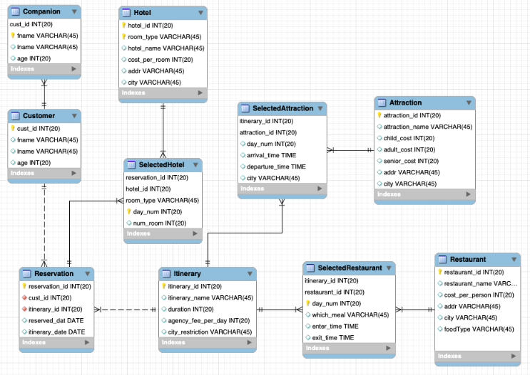

# Angel Travel Company
> **Author: Ellie Yun, yyun.ellie@gmail.com**

## Overview

Angel Travel Company offers its customers travel arrangements exclusively in Florida. Angel has pre-set itineraries that customers can choose from and offers those itineraries
featuring theme parks, restaurants, and attractions. The itineraries do not include hotels but Angel does book hotels for customers according to the customer’s preference and request. All
fees for all tickets, restaurants, hotels, and Angel processing fees are due upon reservation.
Attractions include Disneyworld parks, Universal Studios parks, and related parks in Orlando,
museums and theaters in Jacksonville, historic sites in St. Augustine, among others. Restaurants
are included in itineraries in the spirit of offering variety in types of food. While Angel can offer
those features to its customers, the database is designed to be used by Angel employees. For
example, customers cannot make reservations or check prices with this project, but it is
intended for employees to use the data to view previous or existing customers’ reservations,
offered attractions, visited restaurants and information about those among others.

## DB Design

The following is the ER Diagram displaying the database structure of ‘mydb’ for the Angel Travel Company:

The restaurants and attractions are real; restaurants were researched based on area
and type of food. The addresses of attractions and restaurants included in the tables are the
true addresses. The prices of hotels are also about the average price, with possible exceptions
due to COVID-19 of closures or price drops. The addresses were considered upon arranging
itineraries and scheduling enough time between attractions or restaurants to reach the site,
with exceptions of overlaps when a restaurant is within a theme park.

## Applications

Applications are to calculate revenue, to modify an existing itinerary, and to display the
itinerary schedule. Calculating revenue is broken down into two categories: by customer and by
itinerary. Modifying an existing itinerary is broken into two categories: adding or deleting.
Displaying is demonstrating all itineraries, their attractions, and their restaurants.

### Calculate revenue
#### Calculate revenue by itinerary

Calculating revenue by itinerary helps employees to know which itinerary sets are most
popular and lucrative. Results are shown in a table below the query, which break the itinerary
revenue down into agency processing fees, attraction ticket fees, restaurant fees, and total
revenue per selected itinerary. This information helps the company decide how to modify
offered itineraries especially in accordance with seasons, holidays, etc. 
Customer.

#### Calculate revenue by customer

Calculating revenue by customer enables employees’ access to the total spending on all
reservations, including hotels, per customer overall. For customers who book multiple
reservations, all those costs’ of each reservation are summed together. Most customers have
registered companions, so all those companions are assumed to join the primary customer on
every reserved itinerary. The result is broken down into restaurant fees, hotel costs, attraction
ticket fees, and agency processing fees, and totaled to give the total the customer has ever
spent overall with Angel, including costs for all his or her registered companions on every
reservation. While hotel room sizes accommodate the customer and all companions, it is
possible that more than one adult might decide to share one hotel room with other adults
among his companions during a trip to save on costs.

### Modify an existing itinerary

An existing itinerary can be modified to add not-yet-existent attractions or remove any
attraction. While the editing is done by an employee, a customer may request an additional
attraction be added into his or her itinerary. Other reasons an itinerary may be edited include
attraction proving unprofitable, attraction closed, area unsafe or inaccessible, attraction
recently opened, attraction’s significant gain or loss in popularity due to holiday or season.

#### Add an attraction

If a user tries to add an attraction, they must first select the itinerary to add to in the
dropdown list. The dropdown list will show only the attractions that are not included in the
selected itinerary. Also, the only options in the dropdown list will be in the same city as that
itinerary if applicable. If the tour does not stay in the same city, for example the University Tour, then the city of the attraction to be added, need not be in the same city as any other on
the tour. The information about the city restriction is specified in the Itinerary table. If the
attractions have to be in a specific city, the attribute ‘city\_restriction’ will have the city name. If
it’s not the case, then it will have N/A. If a user tries to add an attraction, they must pass
validity checks for whatever they type in the text box. Day number has to be int, arrival time
and departure time has to be in 24-hour format and hours and minutes separated by colon.
Also, the arrival time has to be before departure time. A further validity check is that there
must be enough time in the selected itinerary at the time-slot on the day that the user tries to
add the attraction. If any of those validity checks failed, it will print out the error message on
the browser and terminate executing the php file.

#### Delete an attraction

If a user tries to delete an attraction, they must similarly enter the itinerary to edit. The
only choices a user will have to choose from for deletion are attractions that exist in the
selected itineraries. Having only relevant options to choose from ensures that the user makes a
valid selection to delete.

### Display the itinerary schedule

Displaying the itinerary schedule shows all itineraries, their attractions, their
restaurants, and the time window planned to enter and exit each, with exceptions of overlap
for restaurants within parks that don’t require leaving the park to visit the restaurant. These are
displayed aesthetically in tables based on itineraries. Hotels are not included because hotels are selected separately by customers. 
